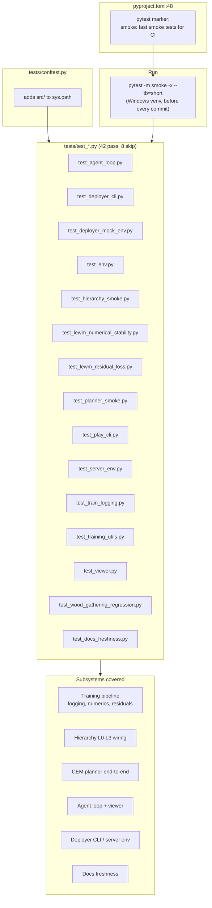

# Smoke tests

Smoke tests in this project are fast pytest tests marked with `@pytest.mark.smoke` and run as a pre-commit gate on Windows. They cover the training pipeline, hierarchy, planner, agent loop, deployer, and docs freshness.

## How it works



## Key points

- **Marker**: `pytest.mark.smoke` declared in `pyproject.toml:48` (`markers = ["smoke: fast smoke tests for CI"]`); opt-in decorator on individual test functions.
- **Command**: `.\.venv-windows\Scripts\python.exe -m pytest -m smoke -x --tb=short` (see `AGENTS.md:143`). Run before every commit.
- **Path setup**: `tests/conftest.py` prepends `src/` to `sys.path` so `from wally...` imports resolve without an editable install.
- **Scope**: ~42 tests across training stability, hierarchy wiring, planner, agent loop, deployer, viewer, and docs freshness.
- **CPU escape hatch**: a handful of fast smoke tests run on CPU via `--device cpu`; production training never falls back to CPU (`src/wally/AGENTS.md`).

## Related: `wally-plan-smoke` CLI

Distinct from the pytest suite. A one-shot world-model sanity check that loads a checkpoint and runs the CEM planner on two synthetic frames:

```bash
uv run wally-plan-smoke
uv run wally-plan-smoke --checkpoint checkpoints/checkpoint_500.pt --output /tmp/probe.pt
```

Defined in `pyproject.toml:39` and implemented in `src/wally/planner/plan_smoke_cli.py`.
